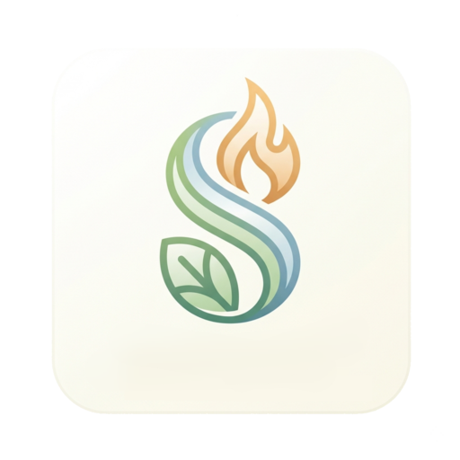

# Seika [App](#)

### A Purified Manga Reader
Discover and read manga, webtoons, comics, and more – with a focus on a purified, adult-content-free experience tailored for the Muslim audience.

*Seika is an open-source fork of the [Mihon](https://mihon.app) manga reader.*

## About Seika

Seika is dedicated to providing a reading experience that aligns with Islamic values. While maintaining the powerful features of Mihon, Seika aims to protect users from harmful visuals and provide spiritual reminders regarding media consumption.

## Features

* **Purified Experience:** Focused on filtering and blocking adult content.
* **Spiritual Reminders:** Integrated reminders and guidance based on Islamic ethics.
* **Disclaimer System:** A mandatory initial disclaimer and easy access to spiritual guidance via the Library FAB.
* **Local Reading:** Support for reading local content.
* **Configurable Reader:** Multiple viewers, reading directions, and extensive settings.
* **Tracker Support:** Support for MyAnimeList, AniList, Kitsu, and more.
* **Categories:** Organize your library efficiently.
* **Themes:** Light and dark theme support.

## Disclaimer

Seika is a fork of Mihon. It is aimed at blocking adult content while maintaining compatibility with various extensions. The goal is to benefit from the positive features of the community while providing a safer environment for faith-conscious readers.

### Spiritual Guidance Included:
1. Protection against Immoral Content (Fawahish).
2. Awareness of Shirk and Magic in fictional plots.
3. Promotion of Islamic Values and Ethics.
4. discouragement of Excessive Violence and Gore.
5. Reminders against Neglecting Religious Duties (Salah).
6. Discernment regarding False Beliefs.

---

### License

<pre>
Copyright © 2015 Javier Tomás
Copyright © 2024 Mihon Open Source Project
Copyright © 2024 Seika Open Source Project

Licensed under the Apache License, Version 2.0 (the "License");
you may not use this file except in compliance with the License.
You may obtain a copy of the License at

http://www.apache.org/licenses/LICENSE-2.0

Unless required by applicable law or agreed to in writing, software
distributed under the License is distributed on an "AS IS" BASIS,
WITHOUT WARRANTIES OR CONDITIONS OF ANY KIND, either express or implied.
See the License for the specific language governing permissions and
limitations under the License.
</pre>

